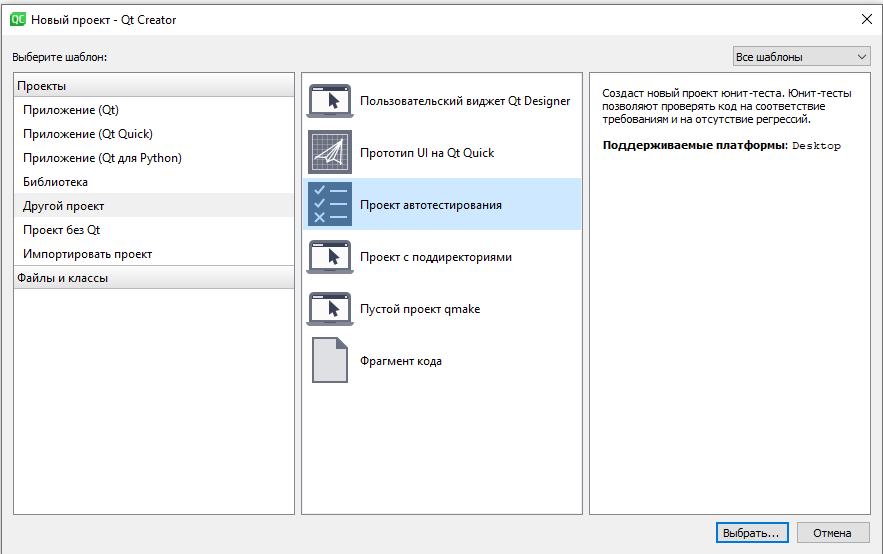
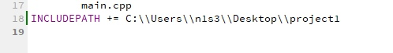
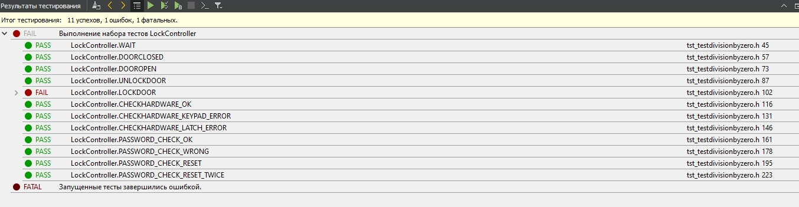

МИНИСТЕРСТВО НАУКИ  И ВЫСШЕГО ОБРАЗОВАНИЯ РОССИЙСКОЙ ФЕДЕРАЦИИ  

Федеральное государственное автономное образовательное учреждение высшего образования  

"КРЫМСКИЙ ФЕДЕРАЛЬНЫЙ УНИВЕРСИТЕТ им. В. И. ВЕРНАДСКОГО"  

ФИЗИКО-ТЕХНИЧЕСКИЙ ИНСТИТУТ  

Кафедра компьютерной инженерии и моделирования
<br/><br/>
### Отчёт по лабораторной работе № 9<br/> по дисциплине "Программирование"
<br/>
​Cтудента 1 курса группы ПИ-б-о-192(1)<br/>
Гусько Елизавета Викторовна<br/>
направления подготовки 09.03.04 "Программная инженерия"  
<br/>


<br/>
<table>

<tr><td>Научный руководитель<br/> старший преподаватель кафедры<br/> компьютерной инженерии и моделирования</td>

<td>(оценка)</td>

<td>Чабанов В.В.</td>

</tr>

</table>

<br/><br/>

​

Симферополь, 2020

<br/>

# Лабораторная работа №9

# Тестирование при помощи Google Test Framework

### ***Цель***: 

1. Познакомиться с Google Test и Google Mock Framework;
2. Изучить базовые понятия относящийся к тестированию кода;
3. Научиться тестировать классы в среде разработки Qt Creator.

### Для выполнения лабораторной работы вам понадобится:

1. IDE Qt Creator;
2. Google Test и Google Mock Framework;
3. Класс для тестирования.

### Подготовка «боевого» проекта

 Перед началом работы мы скачиваем [необходимый архив](project1) с файлами. Сам проект ничего не делает, так что его мы не запускаем.
 
[Исходные файлы](https://github.com/n1s3/lab9/tree/master/test_project) 
### Ход работы:
 
 1. Создаем проект <br/>

>рис 1. создание проекта

#### Настраиваем проект <br/>

>рис 2. добавление боевого проекта

#### Результаты тестирования: <br/>

>рис 3. результаты тестирования
<br/>

Исправление ошибки: 

``` c++
DoorStatus LockController::lockDoor()
{
    return latch->close();
}
```
Ошибка могла возникнуть из-за копирования предыдущего метода

### Вывод: я ознакомилась с Google Test и Google Mock Framework, изучила базовые понятия относящийся к тестированию кода и научилась тестировать классы в среде разработки Qt Creator.
